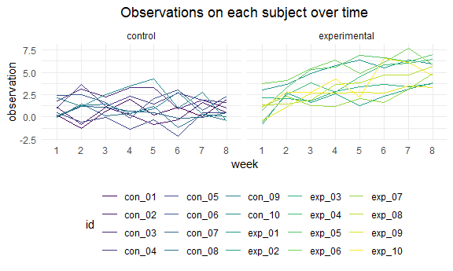

p8105\_hw5\_wc2750
================
Weixi Chen
11/16/2020

## Problem 1

Read in the data

``` r
homicide_df = 
  read_csv("homicide_data/homicide-data.csv") %>%
  mutate(
    city_state = str_c(city, state, sep = "_"),
    resolved = case_when(
      disposition == "Closed without arrest" ~ "unsolved",
      disposition == "Open/No arrest"        ~ "unsolved",
      disposition == "Closed by arrest"      ~ "solved"
    )
  ) %>%
  select(city_state, resolved) %>%
  filter(city_state != "Tulsa_AL")
```

Let’s look at this a bit

``` r
aggregate_df = 
  homicide_df %>%
  group_by(city_state) %>%
  summarise(
    hom_total = n(),
    hom_unsolved = sum(resolved == "unsolved")
  ) %>%
  arrange(hom_total)

aggregate_df
```

    ## # A tibble: 50 x 3
    ##    city_state        hom_total hom_unsolved
    ##    <chr>                 <int>        <int>
    ##  1 Tampa_FL                208           95
    ##  2 Savannah_GA             246          115
    ##  3 San Bernardino_CA       275          170
    ##  4 Durham_NC               276          101
    ##  5 Denver_CO               312          169
    ##  6 Minneapolis_MN          366          187
    ##  7 Sacramento_CA           376          139
    ##  8 Albuquerque_NM          378          146
    ##  9 Long Beach_CA           378          156
    ## 10 Omaha_NE                409          169
    ## # ... with 40 more rows

Can I do a prop test for a single city?

``` r
prop.test(
  aggregate_df %>% filter(city_state == "Baltimore_MD") %>% pull(hom_unsolved),
  aggregate_df %>% filter(city_state == "Baltimore_MD") %>% pull(hom_total)
) %>%
  broom::tidy()
```

    ## # A tibble: 1 x 8
    ##   estimate statistic  p.value parameter conf.low conf.high method    alternative
    ##      <dbl>     <dbl>    <dbl>     <int>    <dbl>     <dbl> <chr>     <chr>      
    ## 1    0.646      239. 6.46e-54         1    0.628     0.663 1-sample~ two.sided

Try to iterate…

``` r
results_df = 
  aggregate_df %>%
  mutate(
    prop_tests = map2(.x = hom_unsolved, .y = hom_total, ~prop.test(x = .x, n = .y)),
    tidy_tests = map(.x = prop_tests, ~broom::tidy(.x))
  ) %>%
  select(-prop_tests) %>%
  unnest(tidy_tests) %>%
  select(city_state, estimate, conf.low, conf.high)
```

``` r
results_df %>%
  mutate(city_state = fct_reorder(city_state, estimate)) %>%
  ggplot(aes(x = city_state, y = estimate)) +
  geom_point() +
  geom_errorbar(aes(ymin = conf.low, ymax = conf.high)) +
  theme(axis.text.x = element_text(angle = 90, vjust = 0.5, hjust = 1))
```


## Problem 2

Import and tidy cohort dataset

``` r
cohort_df = 
  tibble(
    path = list.files("lda_data")
) %>%
  mutate(path = str_c("lda_data/", path),
         data = map(.x = path, ~read_csv(.x))) %>%
  unnest(data) %>%
  mutate(id = str_replace(path, "lda_data/", ""),
         id = str_replace(id, ".csv", "")) %>%
  select(-path) %>%
  mutate(arm = ifelse(str_detect(id, "con"), "control", "experimental")) %>%
  relocate(id, arm)

# preview cohort_df
cohort_df
```

    ## # A tibble: 20 x 10
    ##    id     arm          week_1 week_2 week_3 week_4 week_5 week_6 week_7 week_8
    ##    <chr>  <chr>         <dbl>  <dbl>  <dbl>  <dbl>  <dbl>  <dbl>  <dbl>  <dbl>
    ##  1 con_01 control        0.2  -1.31    0.66   1.96   0.23   1.09   0.05   1.94
    ##  2 con_02 control        1.13 -0.88    1.07   0.17  -0.83  -0.31   1.58   0.44
    ##  3 con_03 control        1.77  3.11    2.22   3.26   3.31   0.89   1.88   1.01
    ##  4 con_04 control        1.04  3.66    1.22   2.33   1.47   2.7    1.87   1.66
    ##  5 con_05 control        0.47 -0.580  -0.09  -1.37  -0.32  -2.17   0.45   0.48
    ##  6 con_06 control        2.37  2.5     1.59  -0.16   2.08   3.07   0.78   2.35
    ##  7 con_07 control        0.03  1.21    1.13   0.64   0.49  -0.12  -0.07   0.46
    ##  8 con_08 control       -0.08  1.42    0.09   0.36   1.18  -1.16   0.33  -0.44
    ##  9 con_09 control        0.08  1.24    1.44   0.41   0.95   2.75   0.3    0.03
    ## 10 con_10 control        2.14  1.15    2.52   3.44   4.26   0.97   2.73  -0.53
    ## 11 exp_01 experimental   3.05  3.67    4.84   5.8    6.33   5.46   6.38   5.91
    ## 12 exp_02 experimental  -0.84  2.63    1.64   2.58   1.24   2.32   3.11   3.78
    ## 13 exp_03 experimental   2.15  2.08    1.82   2.84   3.36   3.61   3.37   3.74
    ## 14 exp_04 experimental  -0.62  2.54    3.78   2.73   4.49   5.82   6      6.49
    ## 15 exp_05 experimental   0.7   3.33    5.34   5.57   6.9    6.66   6.24   6.95
    ## 16 exp_06 experimental   3.73  4.08    5.4    6.41   4.87   6.09   7.66   5.83
    ## 17 exp_07 experimental   1.18  2.35    1.23   1.17   2.02   1.61   3.13   4.88
    ## 18 exp_08 experimental   1.37  1.43    1.84   3.6    3.8    4.72   4.68   5.7 
    ## 19 exp_09 experimental  -0.4   1.08    2.66   2.7    2.8    2.64   3.51   3.27
    ## 20 exp_10 experimental   1.09  2.8     2.8    4.3    2.25   6.57   6.09   4.64

Make a spaghetti plot

``` r
cohort_df %>%
  pivot_longer(week_1:week_8,
               names_to = "week",
               values_to = "observation") %>%
  mutate(week = str_replace(week, "week_", "")) %>%
  ggplot(aes(x = week, y = observation, group = id, color = id)) +
  geom_line() +
  facet_grid(.~arm) +
  labs(title = "Observations on each subject over time") +
  theme(plot.title = element_text(hjust = 0.5))
```



For control group, the observation values of all subjects keep stable
along with an average value in 1.02 with some fluctuations over the 8
weeks; For experimental group, the observation values are generally
above 0 and gradually increase from an average in 1.14 at week 1 to an
average in 5.12 at week 8.

## Problem 3

First generate 5000 datasets with μ = 0

``` r
# creat function for t test
t_test = function(u){
  vec = rnorm(30, sd = 5, mean = u)
  t.test(vec, alternative = "two.sided") %>%
    broom::tidy() %>%
    select(estimate, p.value)
}
```

``` r
# simulate 5000 datasets with μ = 0
set.seed(123)
sim_results0 = 
  rerun(5000, t_test(0)) %>%
  bind_rows

# preview sim_results0
sim_results0
```

    ## # A tibble: 5,000 x 2
    ##    estimate p.value
    ##       <dbl>   <dbl>
    ##  1  -0.236   0.794 
    ##  2   0.892   0.252 
    ##  3   0.122   0.879 
    ##  4  -0.469   0.575 
    ##  5  -0.918   0.388 
    ##  6   0.769   0.379 
    ##  7   0.0735  0.934 
    ##  8  -0.448   0.578 
    ##  9   0.254   0.789 
    ## 10   1.68    0.0483
    ## # ... with 4,990 more rows
